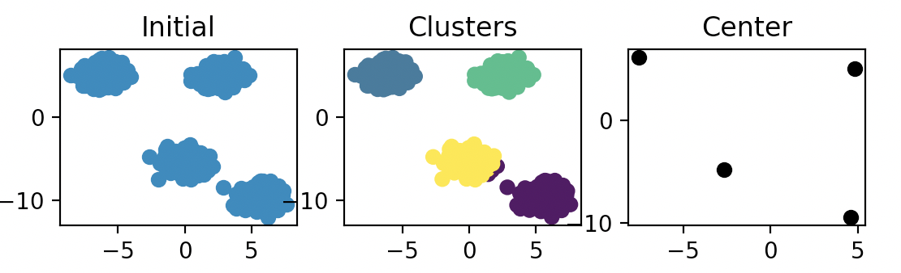

# Self-learning based cluster recognition



## Installation
```bash
pip3 install -U scikit-learn
pip3 install -U matplotlib
```

## Description

The method is intended for dividing objects into clusters. The number of clusters is not known in advance. Clusters are automatically detected when objects are processed.

## Algorithm

1. Select one of the objects. It becomes the prototype for the first cluster;
2. Find the farthest object from the first cluster. This object becomes the prototype for the second cluster;
3. Divide objects into clusters. To do this, find the distance between the cluster and the object. The object belongs to a cluster with a shorter distance;
4. Then, for each cluster, you need to find the object farthest from its cluster;
5. If the distance between this object and the cluster exceeds a certain limiting value, then the object becomes a new cluster;
6. Find the distance between objects and new clusters;
7. Go to step 3;
8. The process continues until such a division into clusters is obtained, in which the distance from each object to the cluster prototype does not exceed the specified limit value.

