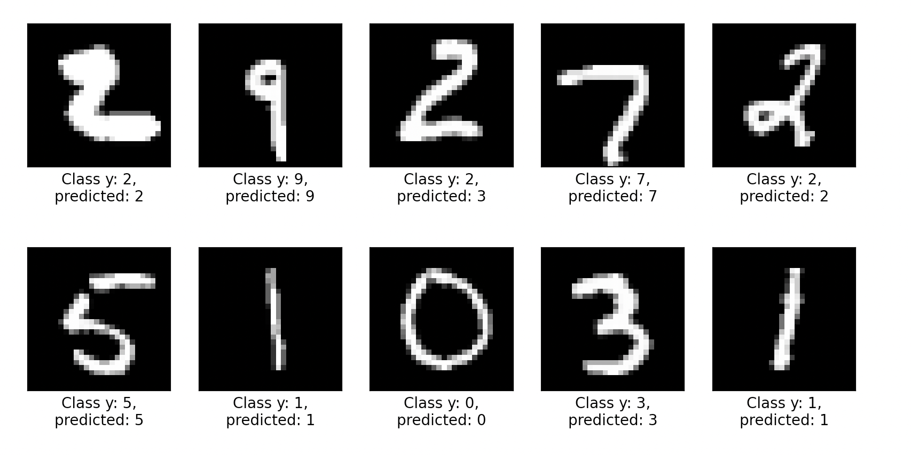

# Multi layer perceptron



## Installation
```bash
pip3 install -U scikit-learn
pip3 install -U matplotlib
```

## Resources

- [Using neural nets to recognize handwritten digits](http://neuralnetworksanddeeplearning.com/chap1.html)
- [Neural Network from scratch in JS - ru](https://runkit.com/jabher/neural-network-from-scratch-in-js---ru)


