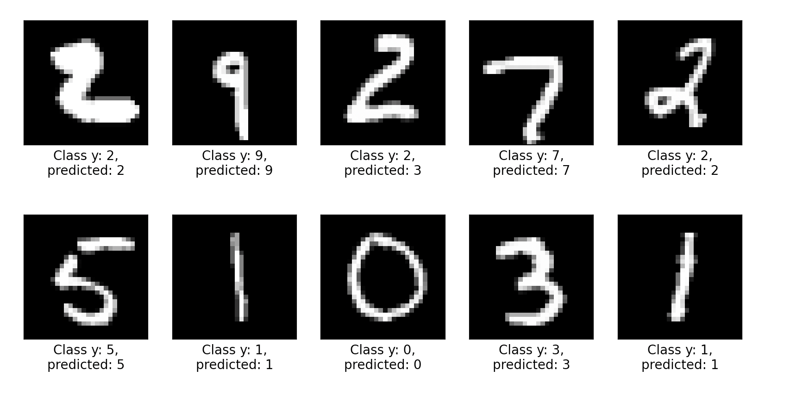
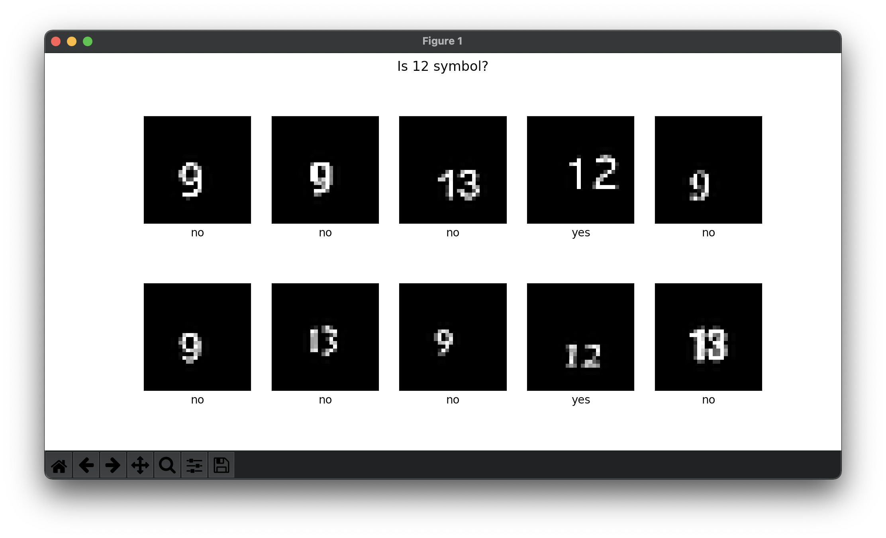
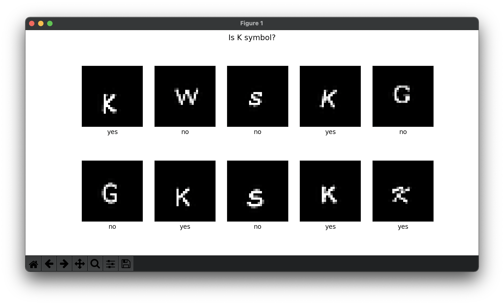

# Multi layer perceptron



## Installation
```bash
pip3 install -U scikit-learn
pip3 install -U matplotlib
```

## Own-data folder
- generator.py - generate test images for the symbol with different fonts;
- train.py - train network based on files from train_{symbol} folder;
- predict.py - predict result for files from test_{symbol} folder.

The neural network consists of 784 neurons at the input, 64 hidden, 2 outputs, where the first output is the desired symbol. In my case, the first output element is `12` and `K`.
 

### Start instruction 
1. cd ./own-data;
2. Extract files from `test-train-K.zip` archive;
3. Move folders from `test-train-K` to `./own-data`:
```bash
cd ./test-train-K
mv ./test_K ../
mv ./train_K ../
cd ../
```
4. Run net predict from `./perceptron` folder:
```bash
python3 ./own-data/predict.py
```

## Resources

- [Using neural nets to recognize handwritten digits](http://neuralnetworksanddeeplearning.com/chap1.html)
- [Neural Network from scratch in JS - ru](https://runkit.com/jabher/neural-network-from-scratch-in-js---ru)


